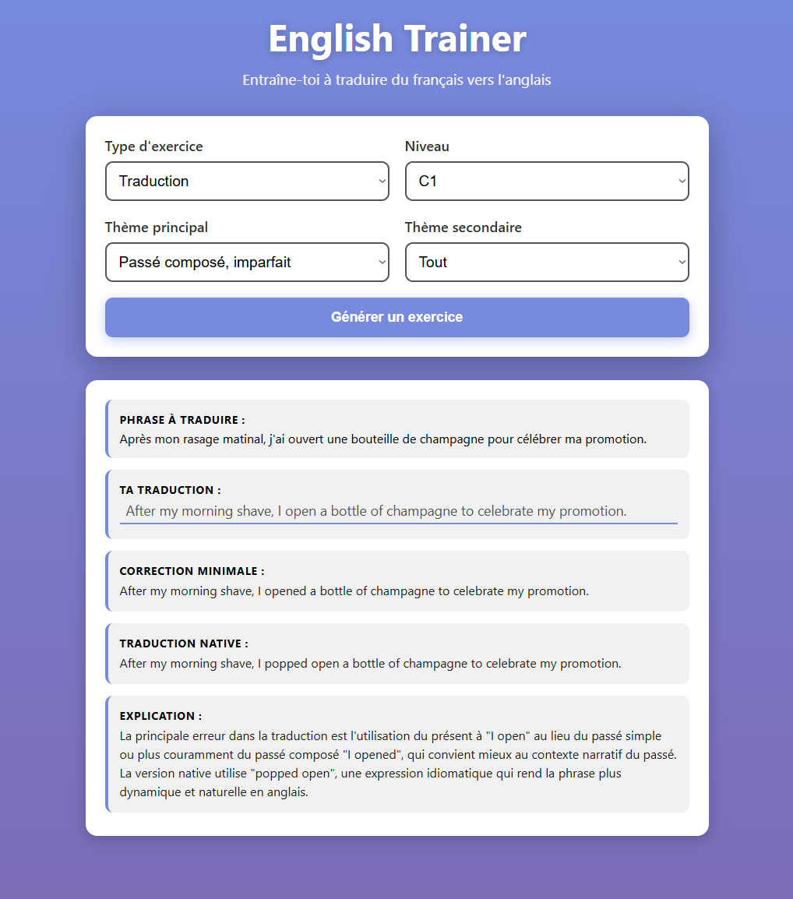

# English Trainer

#### Application web d'entraînement à la traduction français-anglais utilisant un modèle LLM local via Ollama comme tuteur.



## Fonctionnalités
#### Exercice de traduction (phrase simple)
- **Génération de phrases** : génération d'une phrase française adaptée au niveau (B1–C2), incluant un thème grammatical principal et secondaire.
- **Correction progressive** :
  - Correction minimale (grammaire et orthographe)
  - Traduction idiomatique naturelle
  - Explications pédagogiques détaillées
- **Personnalisation** :
  - Choix du niveau
  - Thème principal
  - Thème secondaire


#### Exercice de traduction de paragraphe
- **Génération de paragraphes** : génération d’un paragraphe en français adapté au niveau (B1–C2), incluant un thème grammatical principal et secondaire.
- **Correction progressive** :
  - Correction minimale (grammaire et orthographe)
  - Traduction idiomatique naturelle
  - Explications pédagogiques détaillées
- **Personnalisation** :
  - Choix du niveau
  - Thème principal
  - Thème secondaire

#### Exercice de grammaire
- **Génération de phrases** : génération d’une phrase en anglais correspondant à un thème grammatical d’origine, à transformer vers un autre thème (ex : *futur simple → conditionnel*), selon le niveau (B1–C2).
- **Correction progressive** :
  - Correction idiomatique de la transformation
  - Explications pédagogiques claires
- **Personnalisation** :
  - Choix du niveau
  - Thème d’origine
  - Thème d’arrivée

## Prérequis

- Python 3.x
- [Ollama](https://ollama.ai/) installé
- Flask (`pip install flask`)
- Un modèle Ollama (par défaut : `qwen2.5:14b`)

## Installation

1. Cloner le dépôt
2. Installer les dépendances :
   ```bash
   pip install flask
   ```
3. Installer Ollama et télécharger le modèle :
   ```bash
   ollama pull qwen2.5:14b
   ```

## Lancement

```bash
python app.py
```

L'application s'ouvre automatiquement dans le navigateur sur `http://localhost:5000`


## Utilisation

1. Sélectionner le niveau et les thèmes souhaités
2. Cliquer sur "Générer un exercice"
3. Traduire la phrase française en anglais
4. Consulter les corrections et explications

## Notes

- Les réponses du LLM peuvent varier en qualité selon le modèle utilisé
- L'application nécessite une connexion à Ollama en local